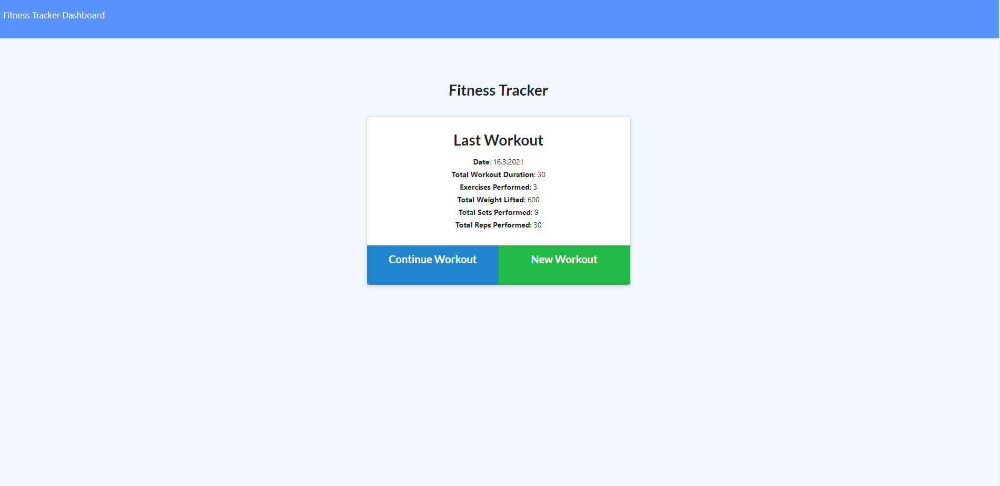

# Workout Tracker  
  
  
 
  

  [Link to webpage](https://arcane-earth-55630.herokuapp.com/)
  
  A consumer will reach their fitness goals more quickly when they track their workout progress.  
    
  ## Table of Content
  [-Installation](#Installation)  
  [-Description](#Description)    
  [-Usage](#Usage)  
  [-Questions](#Questions)  
  
  
  ## Installation  
  to install locally the user requires to npm install the packages and have robo 3T or equvalent to host the database. 

  ## Description  
  As a user, I want to be able to view create and track daily workouts. I want to be able to log multiple exercises in a workout on a given day. I should also be able to track the name, type, weight, sets, reps, and duration of exercise. If the exercise is a cardio exercise, I should be able to track my distance traveled.

  ## Usage  
  Start a New Exercise or continue on your previous one. One user has finished there exercise program the user can enter its last exercise en press "Complete" in the exercise page. On the main page the summary of the users exercise will stand, and on the dashboard/stats page there are graphs and diagrams on how much the user has exercised.
  
  ## Questions?  
  
    My Github link is [Nvrtis](https://github.com/Nvrtis)
    Any futher questions can be sent to my email here  <Nvav91@gmail.com>

  
 
  
  

